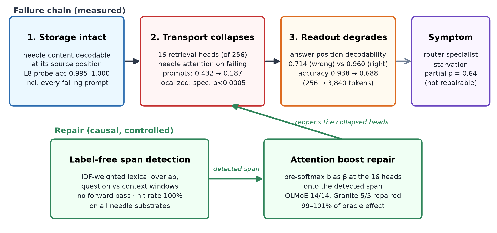

# Expert Atlas

**Localizing context-length degradation in Mixture-of-Experts language models:
retrieval-head collapse, not router failure.**

On two small MoE models (OLMoE-1B-7B and Granite-3.0-3B-A800M), long-context
retrieval failure on a synthetic forced-choice needle task is a *localized
attention-transport* failure: the fact remains linearly decodable at its source
position even when the model answers wrong, a small identifiable set of
retrieval heads stops attending to it at long range (collapse is concentrated
in those heads far beyond random head sets), and re-opening those heads with a
pre-softmax attention bias — targeted at a span located *without ground-truth
labels* — repairs every failing prompt in the tested sets and recovers
~99–101% of the oracle-span effect wherever the question shares lexical
anchors with the needle (~61% via a dev-trained residual probe, or ~45% via a
training-free two-stage lexical chain, where it does not). Router-level
"specialist starvation" correlates with failure but is a downstream symptom:
three preregistered router/residual interventions failed their controls. A
zero-distractor distance sweep further shows the collapse is gated on
distractor competition, not on distance-to-readout alone.

The oracle-repair and label-free stages of the same causal chain replicate on
a third, architecturally distinct model with **no Mixture-of-Experts
component at all** — Pythia-2.8B, a dense GPT-NeoX model — on its own
preregistered substrate (`dense_track/`): all 11 registered failures are
repaired and the label-free detector recovers 51% of the oracle effect. The
collapse measurement on that substrate is itself significant and specific but
falls under the project's own preregistered effect-size floor, and is
reported as suggestive rather than confirmatory for that reason. All results
are under the tested conditions only: three small models (two MoE, one
dense), contexts ≤ 4096 tokens, synthetic retrieval substrates.

The repository also contains the project's earlier phases, kept because their
instruments and negative results are load-bearing: a statistically controlled
expert-specialization atlas (base-rate-corrected lift, FDR, split-half
replication) and a memory-efficient on-demand expert runtime (mmap + lazy
per-token expert loading, bit-identical outputs, ~0.64 GiB process memory vs
~12.66 GiB dense).

**Technical report:** *Localizing Context Length Degradation in a Mixture of
Experts Language Model: Retrieval Head Collapse, Not Router Failure*
(TechRxiv). Figures in [`figures/`](figures/).

---

## The main result in one figure



Full narrative with every intermediate step and failed intervention:
[`docs/CONTEXT_ROT_STORY.md`](docs/CONTEXT_ROT_STORY.md).

## Reading guide

| Document | Contents |
|---|---|
| [`docs/CONTEXT_ROT_STORY.md`](docs/CONTEXT_ROT_STORY.md) | The complete causal chain, in order, including the three failed intervention families |
| [`docs/ATTENTION_TRANSPORT.md`](docs/ATTENTION_TRANSPORT.md) | Retrieval-head identification and the localized-collapse test |
| [`docs/ATTENTION_BOOST_CAUSAL.md`](docs/ATTENTION_BOOST_CAUSAL.md) | The causal attention-boost repair vs matched controls |
| [`docs/SPAN_DISCOVERY_SOLVED.md`](docs/SPAN_DISCOVERY_SOLVED.md) | Label-free span detection (incl. the failed v1, preserved) |
| [`docs/SPANFREE_BOOST.md`](docs/SPANFREE_BOOST.md) | Earlier span-free attempts and their measured limits |
| [`docs/GRANITE_TRANSPORT.md`](docs/GRANITE_TRANSPORT.md) | Second-architecture replication of the full chain |
| [`docs/DISTANCE_ONLY.md`](docs/DISTANCE_ONLY.md) | Zero-distractor distance sweep: collapse is distractor-gated, not distance-driven |
| [`docs/CONTEXT_VARIANTS.md`](docs/CONTEXT_VARIANTS.md) | Paraphrase and multi-hop variants; detector scope limits |
| [`docs/MULTIHOP_CHAIN.md`](docs/MULTIHOP_CHAIN.md) | Training-free two-stage lexical chain for the multi-hop case |
| [`dense_track/REGISTRATION_V2.md`](dense_track/REGISTRATION_V2.md), [`dense_track/RESULTS_V2.md`](dense_track/RESULTS_V2.md) | Third-architecture (Pythia-2.8B, dense, no MoE) replication, registered substrate |
| [`docs/SEMGRAPH_RESULTS.md`](docs/SEMGRAPH_RESULTS.md) | Extension track: semantic + graph-walk span detectors, incl. the coreference result and its harder-substrate follow-up (see below) |
| [`docs/METHOD.md`](docs/METHOD.md) | The full experimental pipeline, both phases |
| [`docs/REPRODUCIBILITY.md`](docs/REPRODUCIBILITY.md) | Models, seeds, hardware, non-obvious requirements |
| [`docs/FINDINGS.md`](docs/FINDINGS.md), [`docs/UTILIZATION.md`](docs/UTILIZATION.md) | Specialization-atlas results (Phase 3) |
| [`docs/ONDEMAND.md`](docs/ONDEMAND.md) | The memory-efficient on-demand expert runtime |

## Reproducing the key results

Setup (Python 3.13; models download once to `data/hf_cache`, ~14 GB for
OLMoE + ~7 GB for Granite + ~11 GB for Pythia-2.8B in fp32):

```bash
python3 -m venv .venv
uv pip install --python .venv/bin/python -e ".[dev]"
export HF_HUB_CACHE="$PWD/data/hf_cache"
# after first download, add: export HF_HUB_OFFLINE=1
```

Tests (231+, no model download needed):

```bash
.venv/bin/python -m pytest tests/ -q --ignore=tests/sanity/test_model_loading.py
```

Core context-rot pipeline (CPU-only works; each step hours-scale, resumable):

```bash
P=".venv/bin/python"
$P scripts/run_context_probe_capture.py        # degradation curve (0.938 -> 0.688)
$P scripts/run_context_pathway.py              # routing correlate (partial rho = 0.64)
$P scripts/run_context_probe_repaired_analyze.py  # storage-vs-transport probes
$P scripts/run_attention_transport.py          # head identification + collapse test
$P scripts/run_attention_boost_causal.py       # oracle-span causal repair (14/14)
$P scripts/run_span_discovery.py               # label-free detector + boost (100.8% of oracle)
$P scripts/run_spanfree_depth.py               # depth-0.15 transfer (10/10)
$P scripts/run_granite_transport.py            # Granite replication (5/5)
$P scripts/run_distance_only.py                # zero-distractor distance sweep (distractor-gated)
$P scripts/run_context_variants.py             # paraphrase / multi-hop scope limits
$P scripts/run_multihop_chain.py               # training-free two-stage chain (45% of oracle)
```

Dense-transformer replication (Pythia-2.8B, no MoE — CPU fp32, run from `dense_track/`):

```bash
$P dense_track/run_sweep.py         # length sweep + attention capture (registered v2 substrate)
$P dense_track/run_transport.py     # head identification + collapse test
$P dense_track/run_boost.py         # oracle-span causal repair (11/11)
$P dense_track/run_spanfree.py      # label-free detector + boost (51% of oracle)
```

Specialization atlas and runtime (Phase 3):

```bash
$P scripts/run_phase3_capture.py   # ~13 h CPU
$P scripts/run_phase3_analyze.py   # lift/FDR/H6 -> data/atlas.json, docs/FINDINGS.md
$P scripts/run_ondemand_benchmark.py  # mmap runtime, bit-identical check
```

Paper figures: `$P scripts/make_paper_figures.py && $P scripts/make_architecture_figure.py`.

## Methodology conventions

Rules the project holds itself to, applied consistently across every result
above:

1. **Lift, not heat.** The primary routing metric is `log2 P(expert|domain) /
   P(expert)`, never raw selection counts — MoE load-balancing training
   pushes marginal expert usage toward uniform by design, so raw usage
   carries almost no information.
2. **Significance and effect size, always both.** Every headline number
   requires FDR correction *and* a practical effect floor (`|lift| >= 1.0`,
   or `|d|` / `|dz| >= 0.8`). Passing significance alone is reported as
   significant but sub-threshold, not as a finding.
3. **Every claim needs a null.** Permutation or label-shuffle tests (>= 200
   shuffles for the specialization atlas, >= 2,000 for the context
   experiments) accompany every claim.
4. **Calibrate on held-out data.** Intervention parameters — head
   identification windows, boost magnitudes, span-detector widths — are
   calibrated on a development bucket excluded from the reported evaluation
   set, stated explicitly at each occurrence.
5. **`norm_topk_prob=False` on OLMoE.** Top-k gate weights do not sum to 1;
   they sum to the top-k probability mass.
6. **Negative results are results.** Where a substrate didn't elicit the
   predicted failure, a detector didn't clear the registered bar, or an
   earlier version had a measurable bug, that is reported as a finding, not
   discarded — see the detector negatives in
   [`docs/SPAN_DISCOVERY_SOLVED.md`](docs/SPAN_DISCOVERY_SOLVED.md) and
   [`docs/SPANFREE_BOOST.md`](docs/SPANFREE_BOOST.md).

## Scope and limitations

- Three small models (two MoE, one dense — 1B-active / 800M-active /
  2.8B-dense), contexts ≤ 4096 tokens, synthetic forced-choice retrieval
  substrates. Not shown for larger models, longer contexts, or naturalistic
  long-context tasks.
- The substrate-level accuracy drop on OLMoE is significant but below the
  preregistered practical floor (d = −0.67 vs the |d| ≥ 0.8 bar).
- The strongest repair uses the oracle needle span; the label-free lexical
  detector matches it only where the question shares lexical anchors with the
  needle, fails on multi-hop composition as a single pass (0% hit) — a
  training-free two-stage chain recovers 45% of the oracle effect there with
  no labels, and the L8 residual-probe fallback recovers 61% with a small
  labeled dev set.
- Granite's failing subset is n=5; subset-only sign-flip significance bottoms
  out at p = 0.0625 by construction — full-set (n=16) tests carry inference.
- Pythia's identified-head collapse contrast is itself significant
  (perm p = 0.048) and specific against a random-cell null (p < 0.0005), but
  its effect size (d = 0.70) misses the project's 0.8 floor — reported as
  suggestive, not confirmatory, for that reason alone; the oracle-repair and
  label-free results on the same substrate were evaluated independently and
  clear their own floors.
- The zero-distractor distance sweep (`docs/DISTANCE_ONLY.md`) is OLMoE-only
  and bounded to ≤ 3,840 tokens; it does not speak to distance-driven failure
  at the much longer contexts (32k–1M tokens) reported elsewhere.
- Paraphrase/multi-hop variants sit at a capability floor (0–12.5% accuracy
  even at 256 tokens); boost results there are assisted capability, not
  recovered context rot.
- H4 co-activation communities are UNRELIABLE (usage skew 227× vs the tool's
  own 2× validity limit) and are reported as such.

## Extension: semantic and graph-walk span discovery

A separate, later track (not part of the main technical report above) tests
whether replacing the lexical detector's IDF-overlap signal with sentence
embeddings and a graph walk extends the label-free span-discovery result
further. Full numbers: [`docs/SEMGRAPH_RESULTS.md`](docs/SEMGRAPH_RESULTS.md);
registrations in `docs/SEMGRAPH_REGISTRATION.md`, `docs/COREF_REGISTRATION.md`,
`docs/COREF_V2_REGISTRATION.md`, `docs/COREF_V2_EXP2_REGISTRATION.md`.

- **Paraphrase**: the semantic detector matches the existing lexical
  detector's result (100% of oracle) without relying on any shared token.
- **Multi-hop**: the graph walk clears the registered bar but ties, rather
  than beats, the existing two-stage lexical chain (48.0% vs. 45.0% of the
  oracle effect).
- **Coreference — the case this was really aimed at.** A discourse-adjacency
  edge in the graph walk fully solves adjacent, unambiguous anaphora (100% of
  the oracle effect, 22/22 repaired) — the one case a purely lexical detector
  cannot reach in principle. A harder, registered follow-up then tested
  whether this generalizes to variable antecedent distance. It does not: the
  same detector, frozen, degrades to the semantic-only floor past distance 1,
  and a distance-tolerant version built specifically to fix that also fails,
  for a verified reason — nearby filler sentences carry no signal that
  distinguishes them from the true referent, so a positional heuristic alone
  cannot resolve them. Reported as a registered negative result, not
  discarded, the same convention as every other negative finding in this
  project.

This track changes only the span locator; it makes no claim about the
transport mechanism's strength, and it is intentionally kept separate from
the main report rather than folded in after the fact.

## License

MIT — see [`LICENSE`](LICENSE).
